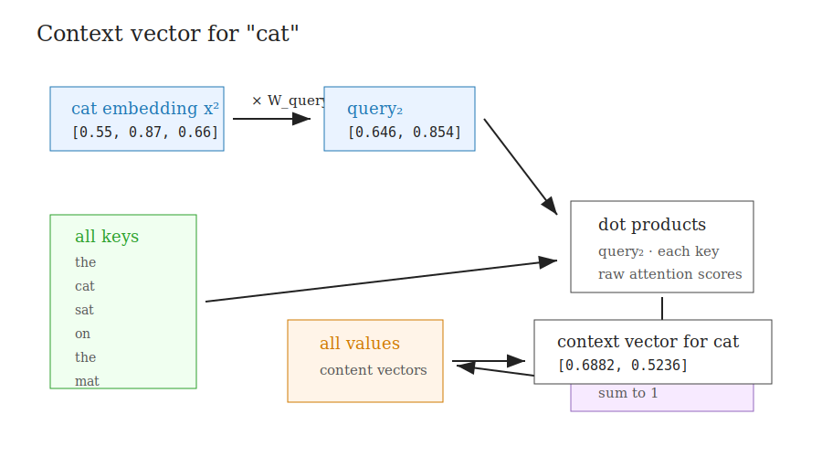
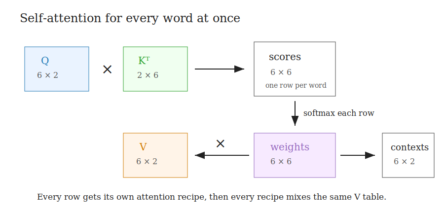
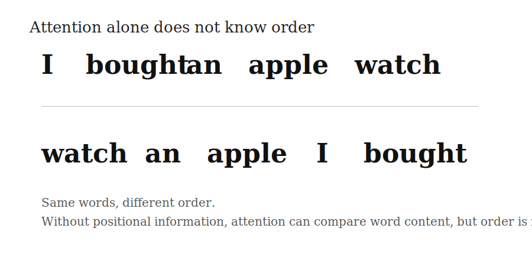

# Building Context With Attention

This note breaks self-attention out into its own small example.

The sentence is:

```text
the cat sat on the mat
```

Each word starts as a 3-number embedding:

```python
inputs = [
    [0.43, 0.15, 0.89],  # the  (x^1)
    [0.55, 0.87, 0.66],  # cat  (x^2)
    [0.57, 0.85, 0.64],  # sat  (x^3)
    [0.22, 0.58, 0.33],  # on   (x^4)
    [0.77, 0.25, 0.10],  # the  (x^5)
    [0.05, 0.80, 0.55],  # mat  (x^6)
]
```

So:

```text
inputs shape = 6 x 3
```

That means:

```text
6 words
3 embedding dimensions per word
```

Run the code with:

```bash
python3 attention.py
```

---

## 1. Projection Matrices

Attention creates three different views of the input:


```text
Q = queries
K = keys
V = values
```

We use these projection matrices:

```python
W_query = [
    [0.10, 0.20],
    [0.30, 0.40],
    [0.50, 0.60],
]

W_key = [
    [0.15, 0.25],
    [0.35, 0.45],
    [0.55, 0.65],
]

W_value = [
    [0.20, 0.10],
    [0.40, 0.30],
    [0.60, 0.50],
]
```

Each matrix has shape:

```text
3 x 2
```

The input dimension must match the embedding dimension.

Here the embeddings have dimension 3, so each projection matrix must start with 3 rows.

The output dimension is chosen by us. Here it is 2, so Q, K, and V will each have 2 numbers per word.

Important:

```text
W_query and W_key usually output the same dimension
```

because we need to take dot products between query vectors and key vectors.

---

## 2. Calculate One Context Vector

Let us calculate the context vector for the second word:



```text
cat
```

Its input embedding is:

```python
x^2 = [0.55, 0.87, 0.66]
```

First, create its query vector:

```text
query_2 = x^2 @ W_query
```

So:

```python
[0.55, 0.87, 0.66] @
[
    [0.10, 0.20],
    [0.30, 0.40],
    [0.50, 0.60],
]
```

This gives:

```text
query_2 = [0.6460, 0.8540]
```

This query means:

```text
when updating "cat", what am I looking for?
```

---

## 3. Create Keys For All Words

Now create key vectors for every word:

```text
keys = inputs @ W_key
```

This gives:

```text
keys =
[
  [0.6065, 0.7535],  # the
  [0.7500, 0.9580],  # cat
  [0.7350, 0.9410],  # sat
  [0.4175, 0.5305],  # on
  [0.2580, 0.3700],  # the
  [0.5900, 0.7300],  # mat
]
```

Each key means:

```text
how should this word be found by a query?
```

---

## 4. Create Values For All Words

Now create value vectors:

```text
values = inputs @ W_value
```

This gives:

```text
values =
[
  [0.6800, 0.5330],  # the
  [0.8540, 0.6460],  # cat
  [0.8380, 0.6320],  # sat
  [0.4740, 0.3610],  # on
  [0.3140, 0.2020],  # the
  [0.6600, 0.5200],  # mat
]
```

Each value means:

```text
what information does this word provide if another word attends to it?
```

---

## 5. Compare `query_2` With Every Key

Now compare the query for `"cat"` with every key:

```text
attention_scores = query_2 @ keys.T
```

That means:

```text
[0.6460, 0.8540] · [0.6065, 0.7535]
[0.6460, 0.8540] · [0.7500, 0.9580]
[0.6460, 0.8540] · [0.7350, 0.9410]
[0.6460, 0.8540] · [0.4175, 0.5305]
[0.6460, 0.8540] · [0.2580, 0.3700]
[0.6460, 0.8540] · [0.5900, 0.7300]
```

This gives:

```text
attention_scores =
[
  1.0353,  # the
  1.3026,  # cat
  1.2784,  # sat
  0.7228,  # on
  0.4827,  # the
  1.0046,  # mat
]
```

The highest raw score is for:

```text
cat
```

followed closely by:

```text
sat
```

So the query for `"cat"` matches most strongly with `"cat"` itself and `"sat"`.

---

## 6. Softmax Turns Scores Into Weights

Raw attention scores are not yet usable mixture weights.

We apply softmax:

```text
attention_weights = softmax(attention_scores)
```

This gives:

```text
attention_weights =
[
  0.1707,  # the
  0.2230,  # cat
  0.2177,  # sat
  0.1249,  # on
  0.0982,  # the
  0.1655,  # mat
]
```

These weights sum to 1.

Now they can be used as a recipe:

```text
17.07% from the
22.30% from cat
21.77% from sat
12.49% from on
9.82% from the
16.55% from mat
```

---

## 7. Mix The Values

Finally, multiply each value vector by its attention weight and add the results:

```text
context_vector_2 =
(0.1707 * [0.6800, 0.5330]) +
(0.2230 * [0.8540, 0.6460]) +
(0.2177 * [0.8380, 0.6320]) +
(0.1249 * [0.4740, 0.3610]) +
(0.0982 * [0.3140, 0.2020]) +
(0.1655 * [0.6600, 0.5200])
```

This gives:

```text
context_vector_2 = [0.6882, 0.5236]
```

This is the updated representation of `"cat"` after it has looked at every word and mixed information from them.

---

## 8. Calculate All Context Vectors

So far, we calculated the context vector for one word.

In self-attention, we do this for every word at once.



First:

```text
queries = inputs @ W_query
```

This gives:

```text
queries =
[
  [0.5330, 0.6800],  # the
  [0.6460, 0.8540],  # cat
  [0.6320, 0.8380],  # sat
  [0.3610, 0.4740],  # on
  [0.2020, 0.3140],  # the
  [0.5200, 0.6600],  # mat
]
```

Then:

```text
attention_scores = queries @ keys.T
```

This gives a 6 x 6 matrix:

```text
attention_scores =
[
  [0.8356, 1.0512, 1.0316, 0.5833, 0.3891, 0.8109],
  [1.0353, 1.3026, 1.2784, 0.7228, 0.4826, 1.0046],
  [1.0147, 1.2768, 1.2531, 0.7084, 0.4731, 0.9846],
  [0.5761, 0.7248, 0.7114, 0.4022, 0.2685, 0.5590],
  [0.3591, 0.4523, 0.4439, 0.2509, 0.1683, 0.3484],
  [0.8127, 1.0223, 1.0033, 0.5672, 0.3784, 0.7886],
]
```

Each row belongs to the word:

```text
row 0 = how much "the" attends to every word
row 1 = how much "cat" attends to every word
row 2 = how much "sat" attends to every word
row 3 = how much "on" attends to every word
row 4 = how much "the" attends to every word
row 5 = how much "mat" attends to every word
```

Then softmax is applied to each row:

```text
attention_weights = softmax(each row)
```

Finally:

```text
context_vectors = attention_weights @ values
```

This gives the context vector for every word:

```text
context_vectors =
[
  [0.6790, 0.5163],  # the
  [0.6882, 0.5236],  # cat
  [0.6873, 0.5229],  # sat
  [0.6665, 0.5064],  # on
  [0.6556, 0.4976],  # the
  [0.6779, 0.5155],  # mat
]
```

The original input shape was:

```text
inputs = 6 x 3
```

The context vector shape is:

```text
context_vectors = 6 x 2
```

So each word started as a 3-number embedding, and each word now has a 2-number context-aware representation.

---

## 9. Why This Matters For RoPE

This attention example shows exactly where RoPE enters.

RoPE does not change the value mixing step directly.

RoPE changes Q and K before we calculate:

```text
attention_scores = queries @ keys.T
```

So with RoPE, the attention score step becomes:

```text
rotated_queries = rope(queries)
rotated_keys = rope(keys)
attention_scores = rotated_queries @ rotated_keys.T
```

That is why RoPE affects:

```text
which words attend to which other words
```

rather than:

```text
what information values contain
```

The value vectors are still what get mixed after the attention weights are computed.

---

## 10. What Attention Does Not Include Yet

This attention walkthrough has not added positional information yet.

That matters because attention compares tokens by content, but it does not naturally know the order of the sequence.

For example:



Both lines contain the same words:

```text
I
bought
an
apple
watch
```

But the order changes the meaning.

Attention by itself can compare the word embeddings, create Q/K/V, produce attention scores, and mix values. But without position information, the model has no built-in way to know which word came first, second, third, and so on.

That is why positional methods are added.

The next step is:

```text
absolute position embeddings
```

or:

```text
RoPE
```

Both methods give attention a way to use order.
