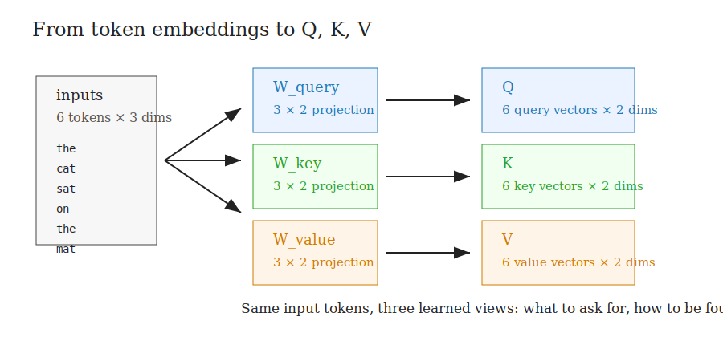
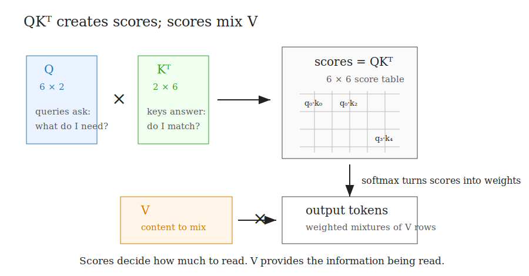
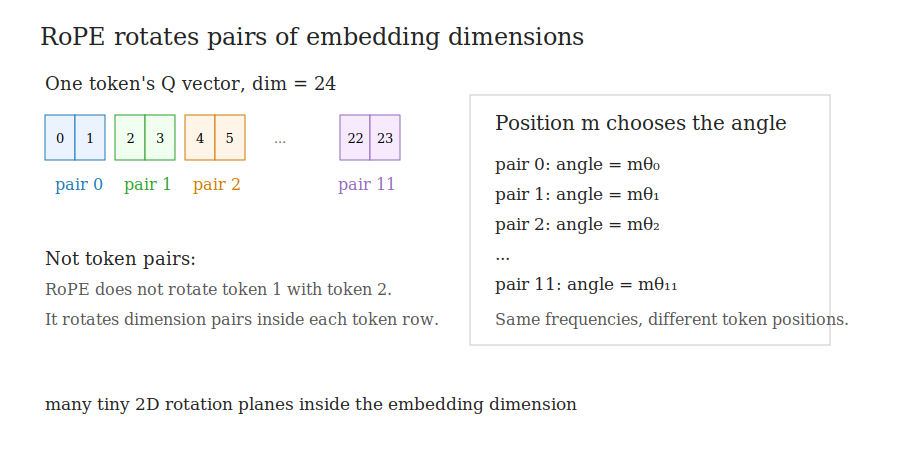
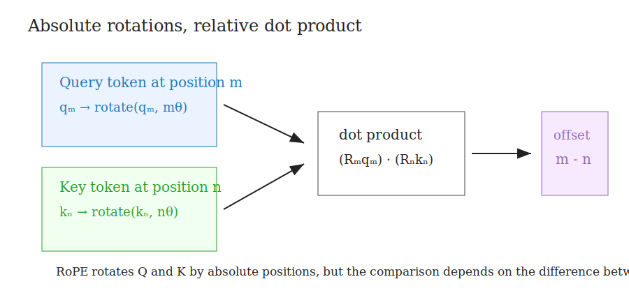
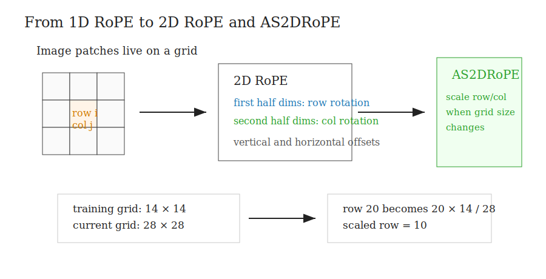

# Code Walkthrough Notes

This note walks through `transformer_walkthrough.py` in the same order as the learning conversation:

1. absolute position embeddings
2. Q, K, V
3. why QK creates attention scores
4. why we multiply by V
5. what RoPE actually rotates
6. how RoPE turns absolute positions into relative-position-aware scores
7. how this extends to 2D RoPE and AS2DRoPE

Run the code with:

```bash
python3 transformer_walkthrough.py
```

How to read this note:

Do not try to memorize every formula on the first pass. The goal is to build a mental picture:

```text
tokens are rows
embedding dimensions are columns
attention compares tokens
RoPE rotates pairs of columns inside Q and K
```

That last line is the big idea. RoPE is not moving tokens around. It is changing the geometry of each token's query/key vector so that attention scores become position-aware.

---

## 1. Absolute Position Embeddings

Before RoPE, it helps to understand the older and simpler approach: absolute position embeddings.

A transformer receives a sequence of token vectors. By itself, attention does not know whether a token came first, second, or third. If we only give it token embeddings, the model sees content, but not order.

So absolute position embeddings add a learned position vector to each token vector.

The first demo is:

```python
demo_absolute_position_embeddings()
```

The important function is:

```python
def absolute_positional_embeddings(sequence, pos_table):
    return [add(token, pos_table[i]) for i, token in enumerate(sequence)]
```

This represents the classic absolute-position approach:

```text
input = token_embedding + position_embedding
```

Think of it like labeling each token with its seat number before the token enters attention.

For example:

```text
"the" at position 0 = embedding("the") + position_vector_0
"cat" at position 1 = embedding("cat") + position_vector_1
"sat" at position 2 = embedding("sat") + position_vector_2
```

The word embedding says what the token is.

The position embedding says where it is.

The position embedding is added before attention.

In a usual transformer, the flow is:

```text
token embedding + position embedding
        ↓
input vector with position info
        ↓
make Q, K, V
        ↓
attention
```

So with absolute position embeddings, Q, K, and V are made from vectors that already contain position information.

That is why we call them absolute:

```text
position 0 has one learned vector
position 1 has another learned vector
position 2 has another learned vector
```

The code prints:

```text
token embeddings
learned absolute position table
token + position
```

The key thing to notice:

The token vector itself changes as soon as the position vector is added.

Beginner checkpoint:

```text
Absolute position embeddings are added to the token representation before Q, K, and V exist.
```

That means Q, K, and V all inherit position information because they are produced from the already-positioned input vector.

---

## 2. Q, K, V And Attention Scores

Now we move from position to attention.

The first thing attention does is create three different projections of the same token sequence. These are Q, K, and V.

Projection just means:

```text
take the input vector and multiply it by a learned matrix
```

So Q, K, and V are not separate input data. They are three learned views of the same input tokens.

The second demo is:

```python
demo_qkv_attention_scores()
```



This uses six token embeddings:

```python
inputs = [
    [0.43, 0.15, 0.89],  # the
    [0.55, 0.87, 0.66],  # cat
    [0.57, 0.85, 0.64],  # sat
    [0.22, 0.58, 0.33],  # on
    [0.77, 0.25, 0.10],  # the
    [0.05, 0.80, 0.55],  # mat
]
```

The shape is:

```text
inputs: 6 tokens × 3 dimensions
```

This means the table has:

```text
6 rows    -> one row per token
3 columns -> three feature values per token
```

In real models, the embedding dimension might be 768, 4096, or larger. Here it is only 3 so the numbers are small enough to inspect.

Then we define:

```python
w_query
w_key
w_value
```

Each weight matrix has shape:

```text
3 × 2
```

So when we multiply:

```python
queries = matmul(inputs, w_query)
keys = matmul(inputs, w_key)
values = matmul(inputs, w_value)
```

we get:

```text
Q: 6 tokens × 2 dimensions
K: 6 tokens × 2 dimensions
V: 6 tokens × 2 dimensions
```

Each token now has:

```text
one query vector
one key vector
one value vector
```

So token 0, `"the"`, has:

```text
q_0 = query vector for "the"
k_0 = key vector for "the"
v_0 = value vector for "the"
```

Token 1, `"cat"`, has:

```text
q_1
k_1
v_1
```

and so on.

Key idea:

```text
Q = what am I looking for?
K = how should I be found?
V = what information do I provide?
```

This is why Q and K are used for matching.

The query asks a question.

The key advertises what a token can match with.

The value contains the information that gets passed along if the match is strong.

---

## 3. Why QKᵀ Produces Attention Scores

This is the heart of attention.

Every token asks:

```text
Which other tokens are relevant to me?
```

The query for one token is compared with the key for every token.

The code does:

```python
raw_scores = matmul(queries, transpose(keys))
```



This is:

```text
QKᵀ
```

Because Q has shape:

```text
6 × 2
```

and Kᵀ has shape:

```text
2 × 6
```

the score matrix has shape:

```text
6 × 6
```

That means:

```text
each token compares with every token
```

A single score is:

```text
q_i · k_j
```

A dot product is large when two vectors point in similar directions.

So if:

```text
q_i · k_j
```

is large, the model interprets that as:

```text
token j is relevant to token i
```

If it is small, token j is less relevant to token i.

This asks:

```text
How much should token i pay attention to token j?
```

So QKᵀ is the attention routing table.

Each row is one token asking where to look.

Each column is one possible token to look at.

For six tokens, the table is:

```text
6 query tokens × 6 key tokens
```

So row 0 answers:

```text
when updating token 0, how much should I look at tokens 0..5?
```

Row 1 answers:

```text
when updating token 1, how much should I look at tokens 0..5?
```

It decides:

```text
who should look at whom?
how strongly?
```

This is why QK is the part RoPE cares about.

RoPE wants position to affect the attention pattern, and the attention pattern is created by QKᵀ.

Beginner checkpoint:

```text
QKᵀ does not move information yet.
QKᵀ only decides attention scores.
```

The information movement happens when those scores are applied to V.

---

## 4. Why We Multiply By V

The attention scores tell us where to look, but they do not contain the content we want to copy.

That content lives in V.

After creating raw scores, the code does:

```python
weights_for_first_token = softmax(raw_scores[0])
```

The raw scores are not yet percentages. Softmax turns them into weights.

Softmax also makes each row add up to 1.

So a row becomes a mixture recipe:

```text
10% from token 0
20% from token 1
35% from token 2
...
```

For example:

```text
token 0 attends 17% here
token 0 attends 21% there
token 0 attends 20% there
...
```

Then the code mixes the value vectors:

```python
mixed = zeros(len(values[0]))
for weight, value in zip(weights_for_first_token, values):
    mixed = add(mixed, mul_scalar(value, weight))
```

That means:

```text
output for token 0 =
weight_0 * value_0
+ weight_1 * value_1
+ weight_2 * value_2
+ ...
```

This is a weighted average of value vectors.

So the output for a token is not copied from just one other token. It is usually a blend of many tokens, with some contributing more than others.

So:

```text
QKᵀ decides how much to read
V contains what gets read
```

Short version:

```text
QKᵀ = where to look
V = what information to take
```

This split is useful for understanding RoPE:

```text
If we want position to change "where to look,"
we should modify Q and K.

If we modify V, we change the information being copied,
but not the attention scores themselves.
```

---

## 5. What RoPE Actually Rotates

This was the big point of confusion.

It is very natural to think RoPE rotates token 1 toward token 2, or rotates token pairs in the sequence.

But that is not what happens.

RoPE does not rotate token 1 with token 2.

RoPE rotates pairs of dimensions inside each token's Q and K vector.



If Q has shape:

```text
6 tokens × 24 dimensions
```

RoPE acts across the 24 dimensions inside each row.

It does not act down the 6 token rows.

The function is:

```python
def rope_1d(x, position, base=10000.0):
    out = x[:]
    dim = len(x)
    for i in range(0, dim, 2):
        inv_freq = 1.0 / (base ** (i / dim))
        angle = position * inv_freq
        if i + 1 < dim:
            out[i], out[i + 1] = rotate_pair(x[i], x[i + 1], angle)
    return out
```

The important line is:

```python
for i in range(0, dim, 2):
```

That means:

```text
take dimensions 0 and 1
then dimensions 2 and 3
then dimensions 4 and 5
...
```

Each pair is treated like a tiny 2D vector.

This is where the rotation matrix proof matters.

Every pair:

```text
(q0, q1)
```

is treated like a point in a 2D plane. Then RoPE applies:

```text
[[cos angle, -sin angle],
 [sin angle,  cos angle]]
```

to that pair.

For example, if one query vector has dimension 8:

```text
q = [q0, q1, q2, q3, q4, q5, q6, q7]
```

RoPE groups it as:

```text
(q0, q1)
(q2, q3)
(q4, q5)
(q6, q7)
```

Each pair gets rotated using the rotation matrix:

```text
[[cos angle, -sin angle],
 [sin angle,  cos angle]]
```

The clean takeaway:

```text
tokens choose the angle
embedding-dimension pairs get rotated
```

This sentence is worth repeating:

```text
Tokens choose the angles.
Dimensions are what rotate.
```

The token position determines the angle.

The embedding dimension pairs are the little 2D planes where the rotation happens.

---

## 6. Six Tokens, Q/K Dim 24

This section exists because the dimensions can be confusing.

When we say:

```text
6 tokens, Q/K dim 24
```

we mean Q and K each look like a table:

```text
6 rows
24 columns
```

Rows are tokens. Columns are features.

The third demo is:

```python
demo_rope_dimension_pairs()
```

It sets:

```python
dim = 24
positions = list(range(6))
```

So we have:

```text
6 token positions
24 Q/K dimensions
```

Since RoPE rotates dimensions in pairs:

```text
24 dimensions = 12 pairs
```

The pairs are:

```text
(dim 0, dim 1)
(dim 2, dim 3)
(dim 4, dim 5)
...
(dim 22, dim 23)
```

Each token row has all 12 pairs.

So there are 12 frequencies:

```text
θ₀, θ₁, θ₂, ..., θ₁₁
```

But the token position multiplies those frequencies.

For token position m:

```text
pair 0  uses angle mθ₀
pair 1  uses angle mθ₁
pair 2  uses angle mθ₂
...
pair 11 uses angle mθ₁₁
```

So the tokens do not all get the same angles.

This was another important confusion point.

All tokens share the same frequency list:

```text
θ₀, θ₁, θ₂, ...
```

But token position changes the actual angle.

They share the same frequency set, but each token scales it by its position.

Example:

```text
token 0:
0θ₀, 0θ₁, 0θ₂, ...

token 1:
1θ₀, 1θ₁, 1θ₂, ...

token 2:
2θ₀, 2θ₁, 2θ₂, ...
```

This is how position enters RoPE.

Beginner checkpoint:

```text
Same frequencies for every token.
Different actual angles because each token has a different position.
```

So token 0 and token 5 are not receiving the same rotation. Token 5 multiplies every frequency by 5.

---

## 7. Why Different Frequencies Matter

Another important question was:

Why not rotate every dimension pair by the same angle?

This question is excellent because a single rotation angle feels like it should be enough.

If the only goal were to mark position somehow, one frequency could mark position.

But the model needs position to be useful across many distances:

```text
nearby words
medium-distance words
far-apart words
```

You could, but it would give only one positional timescale.

RoPE uses many frequencies:

```text
early pairs rotate faster
later pairs rotate slower
```

Fast-changing pairs are sensitive to small shifts.

Slow-changing pairs remain stable over longer distances.

In the code:

```python
inv_freq = 1.0 / (base ** (i / dim))
```

As i increases, the frequency gets smaller.

So:

```text
pair 0 rotates the most
later pairs rotate less
```

This gives the model many little rotation planes:

```text
fast-changing position view
medium-changing position view
slow-changing position view
```

A helpful analogy:

```text
second hand
minute hand
hour hand
```

Each hand moves at a different speed, and together they represent time more richly than one hand alone.

RoPE does the same thing for position.

Beginner checkpoint:

```text
Different dimension pairs are like different clocks.
Together they give a richer position signal than one clock alone.
```

This is also why it helped to think beyond one unit circle. RoPE is many 2D rotation planes side by side inside the embedding dimension.

---

## 8. How RoPE Becomes Relative-Position Aware

This is the subtle magic.

RoPE uses absolute positions to choose rotations:

```text
position 0
position 1
position 2
```

But when attention compares Q and K, the result depends on relative difference.



The fourth demo is:

```python
demo_rope_relative_scores()
```

It uses one simple 2D query and key:

```python
q = [1.0, 0.0]
k = [1.0, 0.0]
```

Then it rotates q and k by different token positions.

For example:

```text
q at position 0
k at position 4
```

The query is rotated by:

```text
0θ
```

The key is rotated by:

```text
4θ
```

When we take the dot product:

```text
rotate(q, 0θ) · rotate(k, 4θ)
```

the two vectors have been rotated by different amounts.

A dot product is sensitive to the angle between vectors.

So if one vector is rotated by 0θ and another by 4θ, their comparison contains a 4θ difference.

the comparison depends on the difference:

```text
0θ - 4θ
```

So attention can sense the relative offset:

```text
0 - 4 = -4
```

This is the magic:

```text
RoPE rotates Q and K using absolute positions,
but QK dot products expose relative positions.
```

So RoPE is not "relative" because it directly stores relative positions.

It is relative because the QK comparison naturally produces relative offsets.

Beginner checkpoint:

```text
RoPE before dot product: absolute rotations
RoPE during dot product: relative position signal
```

That is why people say RoPE is relative-position aware.

---

## 9. Why RoPE Applies To Q And K, Not V

At this point, the reason should feel more natural.

Q and K create the attention scores.

V does not create the scores. V is mixed after the scores are known.

QKᵀ creates the attention scores.

Those scores decide:

```text
who should attend to whom?
```

So if we want position to affect the attention pattern, we should affect Q and K.

V is different.

V contains the information that gets mixed after attention weights are computed.

So RoPE usually rotates:

```text
Q and K
```

not:

```text
V
```

because RoPE is about changing the attention score computation.

Another way to say it:

```text
RoPE changes which tokens look relevant to each other.
That relevance is computed by QKᵀ.
```

So RoPE belongs on Q and K.

---

## 10. 2D RoPE

Now we move from text to images.



For text, each token has one position:

```text
token index
```

For images, each patch has two positions:

```text
row
column
```

The 2D RoPE demo is:

```python
demo_2d_rope()
```

For images, a patch does not just have a token index.

It has:

```text
row, column
```

So `rope_2d` splits the vector into two halves:

```python
half = len(x) // 2
row_part = rope_1d(x[:half], row, base)
col_part = rope_1d(x[half:], col, base)
return row_part + col_part
```

That means:

```text
first half of dimensions  -> rotated by row
second half of dimensions -> rotated by column
```

This is the image version of the same idea:

```text
tokens choose the angle
```

becomes:

```text
row chooses one set of angles
column chooses another set of angles
```

So attention can sense vertical and horizontal offsets separately.

That matters because image relationships are spatial:

```text
above / below
left / right
near / far
```

2D RoPE gives attention a way to reason about those directions.

---

## 11. AS2DRoPE

AS2DRoPE adds one more practical piece: resolution changes.

The model might train on one patch grid size, but receive a different one at inference time.

The AS2DRoPE demo is:

```python
demo_as2drope()
```

The key lines are:

```python
scaled_row = row * training_rows / current_rows
scaled_col = col * training_cols / current_cols
```

This handles different image resolutions.

Without scaling, a model trained on 14 rows might suddenly see row 27.

That is outside the coordinate range it learned during training.

If the model trained on:

```text
14 × 14 patches
```

but now sees:

```text
28 × 28 patches
```

then raw positions would go from:

```text
0..27
```

Instead, AS2DRoPE rescales them back into the training coordinate range:

```text
row 20 -> 20 * 14 / 28 = 10
```

This is interpolation scaling.

It does not mean resolution is free forever.

It means the position encoding can adapt to arbitrary patch-grid sizes by scaling the coordinates before applying 2D RoPE.

Beginner checkpoint:

```text
2D RoPE says: use row and column.
AS2DRoPE says: scale row and column when the grid size changes.
```

---

## 12. The Transformer Block

This final section shows where the pieces sit in a transformer block.

The block is not trying to introduce new math. It is showing the familiar Llama-style structure:

```text
normalize
attention
residual
normalize
feed-forward
residual
```

The final demo is:

```python
demo_transformer_block()
```

The code follows the same layout as the Llama-style block:

```python
self.attn
self.feed_forward
self.norm1
self.norm2
```

The block does:

```text
LayerNorm
Attention
Residual add
LayerNorm
FeedForward
Residual add
```

Residual means:

```text
add the input of the sublayer back to its output
```

This helps information and gradients flow through many layers.

In code:

```python
shortcut = x
x = self.norm1(x)
x = self.attn(x, positions)
x = shortcut + x

shortcut = x
x = self.norm2(x)
x = self.feed_forward(x)
x = shortcut + x
```

The attention class applies RoPE here:

```python
if self.use_rope and positions is not None:
    queries = [rope_1d(q, positions[i]) for i, q in enumerate(queries)]
    keys = [rope_1d(k, positions[i]) for i, k in enumerate(keys)]
```

That line captures the final idea:

```text
each token's Q and K are rotated by that token's position
then QK attention scores are computed
```

So the local order is:

```text
1. make Q, K, V
2. rotate Q and K using token positions
3. compute QKᵀ scores
4. softmax the scores
5. use the scores to mix V
```

---

## Summary

The journey is:

```text
absolute embeddings:
add a position vector before Q/K/V

attention:
QKᵀ decides who looks at whom
V provides the information being mixed

RoPE:
do not add position vectors
rotate Q/K dimension pairs by token position

relative position:
Q and K are rotated by absolute positions
their dot product exposes position differences

2D RoPE:
use row and column rotations for image patches

AS2DRoPE:
scale row/column coordinates when resolution changes
```

The most important sentence:

```text
Tokens choose the angles; embedding-dimension pairs get rotated; QK dot products reveal relative distance.
```
