# From Trigonometric Proofs To The Rotation Matrix

Goal:

Build the trigonometric facts in the same order as the reference sheet, then use them to prove why

$$
\begin{bmatrix}
\cos\theta & -\sin\theta \\
\sin\theta & \cos\theta
\end{bmatrix}
$$

rotates points in the plane.

---

## 1. cos²θ + sin²θ = 1

We have already established that any point on the unit circle is defined by the coordinates

$$
(\cos\theta, \sin\theta)
$$

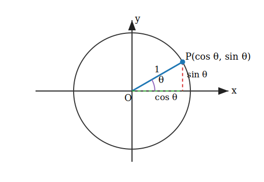

In the diagram,

$$
|OP| = 1
$$

Therefore,

$$
|OP|^2 = 1
$$

Using the distance formula from O = (0, 0) to P = (cos θ, sin θ),

$$
(\cos\theta - 0)^2 + (\sin\theta - 0)^2 = 1
$$

So,

$$
\boxed{\cos^2\theta + \sin^2\theta = 1}
$$

This is the Pythagorean theorem on the unit circle.

---

## 2. Sine Formula

For a triangle ABC, let the side opposite angle A be a, the side opposite angle B be b, and the side opposite angle C be c.

We prove:

$$
\frac{a}{\sin A} = \frac{b}{\sin B} = \frac{c}{\sin C}
$$

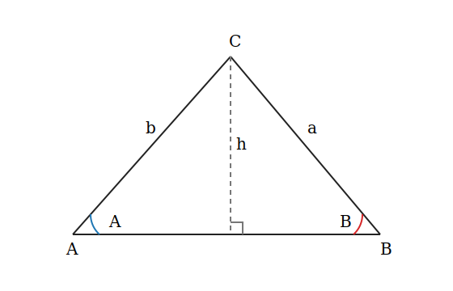

Construct a perpendicular height h from C to AB.

In the left right triangle,

$$
\frac{h}{b} = \sin A
$$

Therefore,

$$
h = b\sin A
$$

In the right right triangle,

$$
\frac{h}{a} = \sin B
$$

Therefore,

$$
h = a\sin B
$$

Equating the two expressions for h,

$$
b\sin A = a\sin B
$$

Divide both sides by sin A sin B:

$$
\frac{b\sin A}{\sin A\sin B}
=
\frac{a\sin B}{\sin A\sin B}
$$

So,

$$
\frac{b}{\sin B}
=
\frac{a}{\sin A}
$$

Therefore,

$$
\frac{a}{\sin A}
=
\frac{b}{\sin B}
$$

Similarly,

$$
\frac{b}{\sin B}
=
\frac{c}{\sin C}
$$

Thus,

$$
\boxed{
\frac{a}{\sin A}
=
\frac{b}{\sin B}
=
\frac{c}{\sin C}
}
$$

---

## 3. Cosine Formula

We prove:

$$
a^2 = b^2 + c^2 - 2bc\cos A
$$

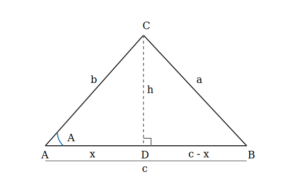

In triangle ABC, let CD be perpendicular to AB.

Let

$$
|CD| = h
$$

and

$$
|AD| = x
$$

Then

$$
|DB| = c - x
$$

Apply the Pythagorean theorem to triangles ACD and BCD.

In triangle ACD:

$$
h^2 + x^2 = b^2
$$

So,

$$
h^2 = b^2 - x^2
$$

In triangle BCD:

$$
h^2 + (c - x)^2 = a^2
$$

So,

$$
h^2 = a^2 - (c - x)^2
$$

Equating the two expressions for h²:

$$
a^2 - (c - x)^2 = b^2 - x^2
$$

Expanding:

$$
a^2 - (c^2 - 2cx + x^2) = b^2 - x^2
$$

So,

$$
a^2 - c^2 + 2cx - x^2 = b^2 - x^2
$$

Cancel -x² from both sides:

$$
a^2 - c^2 + 2cx = b^2
$$

Therefore,

$$
a^2 = b^2 + c^2 - 2cx
$$

But

$$
\frac{x}{b} = \cos A
$$

So,

$$
x = b\cos A
$$

Substitute this into the formula:

$$
a^2 = b^2 + c^2 - 2c(b\cos A)
$$

Therefore,

$$
\boxed{a^2 = b^2 + c^2 - 2bc\cos A}
$$

Similarly,

$$
b^2 = c^2 + a^2 - 2ca\cos B
$$

and

$$
c^2 = a^2 + b^2 - 2ab\cos C
$$

---

## 4. cos(A - B) = cos A cos B + sin A sin B

Let the radii OP and OQ make angles A and B with the positive x-axis.

Then

$$
P = (\cos A, \sin A)
$$

and

$$
Q = (\cos B, \sin B)
$$

The angle between the two radii is

$$
A - B
$$

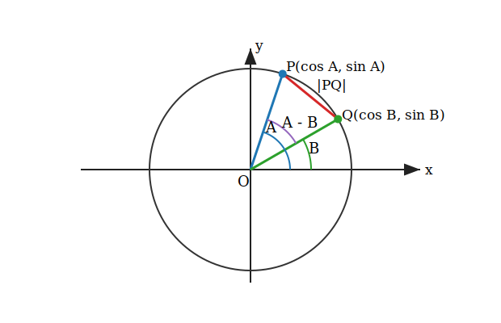

We now find |PQ|² using two methods.

First, using the distance formula:

$$
|PQ|^2
=
(\cos A - \cos B)^2 + (\sin A - \sin B)^2
$$

Expanding:

$$
|PQ|^2
=
\cos^2 A - 2\cos A\cos B + \cos^2 B
+
\sin^2 A - 2\sin A\sin B + \sin^2 B
$$

Using

$$
\cos^2 A + \sin^2 A = 1
$$

and

$$
\cos^2 B + \sin^2 B = 1
$$

we get

$$
|PQ|^2
=
2 - 2(\cos A\cos B + \sin A\sin B)
$$

Second, using the cosine formula in triangle OPQ:

$$
|PQ|^2
=
|OP|^2 + |OQ|^2 - 2|OP||OQ|\cos(A - B)
$$

Since

$$
|OP| = |OQ| = 1
$$

we get

$$
|PQ|^2
=
1^2 + 1^2 - 2(1)(1)\cos(A - B)
$$

So,

$$
|PQ|^2
=
2 - 2\cos(A - B)
$$

Equating the two expressions for |PQ|²:

$$
2 - 2(\cos A\cos B + \sin A\sin B)
=
2 - 2\cos(A - B)
$$

Therefore,

$$
\boxed{\cos(A - B) = \cos A\cos B + \sin A\sin B}
$$

---

## 5. cos(A + B) = cos A cos B - sin A sin B

On the unit circle, changing an angle from B to -B reflects the point across the x-axis.

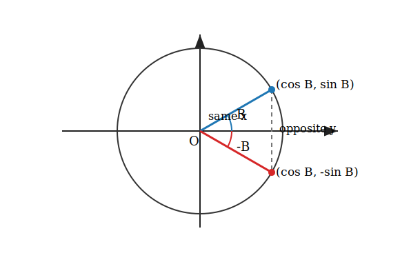

The x-coordinate stays the same, while the y-coordinate changes sign.

Therefore,

$$
\cos(-B) = \cos B
$$

and

$$
\sin(-B) = -\sin B
$$

To derive the formula for cos(A + B), replace B with -B in the previous formula:

$$
\cos(A - B) = \cos A\cos B + \sin A\sin B
$$

Then

$$
\cos(A - (-B))
=
\cos A\cos(-B) + \sin A\sin(-B)
$$

So,

$$
\cos(A + B)
=
\cos A\cos B + \sin A(-\sin B)
$$

Therefore,

$$
\boxed{\cos(A + B) = \cos A\cos B - \sin A\sin B}
$$

---

## 6. cos 2A = cos²A - sin²A

Using the cosine addition formula,

$$
\cos(A + B) = \cos A\cos B - \sin A\sin B
$$

Set

$$
B = A
$$

Then

$$
\cos(A + A)
=
\cos A\cos A - \sin A\sin A
$$

Therefore,

$$
\cos 2A = \cos^2 A - \sin^2 A
$$

So,

$$
\boxed{\cos 2A = \cos^2 A - \sin^2 A}
$$

---

## 7. sin(A + B) = sin A cos B + cos A sin B

We need the sine addition formula for the final rotation-matrix proof.

Before proving it, we first prove a smaller fact from the unit circle only.

For any angle X, the point at angle X is

$$
(\cos X, \sin X)
$$

The point at angle 90° - X is the complementary direction. In the quadrant-I picture, the horizontal and vertical side lengths swap:

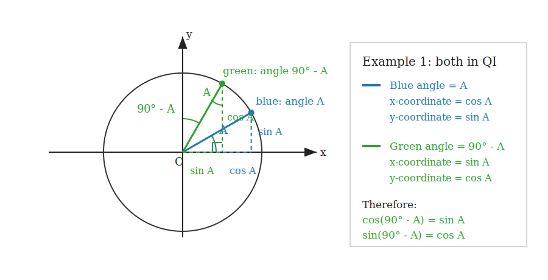

$$
(\cos(90^\circ - X), \sin(90^\circ - X))
$$

Important: the angle between the original ray X and the complementary ray 90° - X is not generally 90°. Rather, the two angle measures are complementary:

$$
X + (90^\circ - X) = 90^\circ
$$

Since the x-coordinate of the complementary point matches the y-coordinate of the original point, and the y-coordinate of the complementary point matches the x-coordinate of the original point, we get:

$$
\cos(90^\circ - X) = \sin X
$$

and

$$
\sin(90^\circ - X) = \cos X
$$

Now set X = A:

$$
\cos(90^\circ - A) = \sin A
$$

and

$$
\sin(90^\circ - A) = \cos A
$$

The same identities still work when signs are involved, because sine and cosine are signed coordinates on the unit circle:

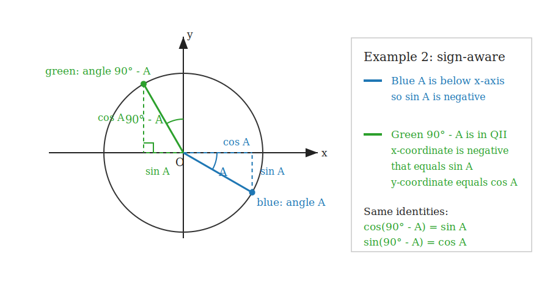

In example 2, the green point is in quadrant II, so its x-coordinate is negative. That negative sign is already contained in sin A because the blue angle A is below the x-axis.

Using the cosine difference formula,

$$
\cos(A - B) = \cos A\cos B + \sin A\sin B
$$

replace A with 90° - A:

$$
\cos((90^\circ - A) - B)
=
\cos(90^\circ - A)\cos B
+
\sin(90^\circ - A)\sin B
$$

Since

$$
(90^\circ - A) - B = 90^\circ - (A + B)
$$

we have

$$
\cos(90^\circ - (A + B))
=
\sin A\cos B + \cos A\sin B
$$

Using the cofunction identity we proved above with X = A + B:

$$
\cos(90^\circ - X) = \sin X
$$

so

$$
\boxed{\sin(A + B) = \sin A\cos B + \cos A\sin B}
$$

---

## 8. The 90° Shift Identities

Set B = 90° in the addition formulas.

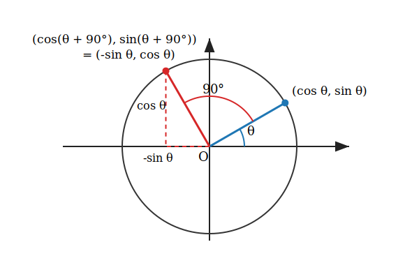

From cosine addition:

$$
\cos(\theta + 90^\circ)
=
\cos\theta\cos90^\circ - \sin\theta\sin90^\circ
$$

Since

$$
\cos90^\circ = 0
$$

and

$$
\sin90^\circ = 1
$$

we get

$$
\boxed{\cos(\theta + 90^\circ) = -\sin\theta}
$$

From sine addition:

$$
\sin(\theta + 90^\circ)
=
\sin\theta\cos90^\circ + \cos\theta\sin90^\circ
$$

So,

$$
\boxed{\sin(\theta + 90^\circ) = \cos\theta}
$$

---

## 9. Rotating The Point (1, 0)

The point (1, 0) is on the unit circle at angle 0.

If we rotate it counterclockwise by angle θ, it lands at the point on the unit circle with angle θ.

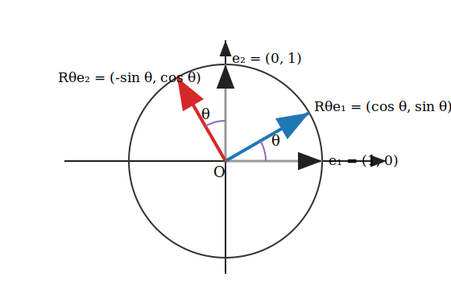

Therefore,

$$
(1, 0)
\quad \xrightarrow{\text{rotate by } \theta} \quad
(\cos\theta, \sin\theta)
$$

In vector form,

$$
e_1 =
\begin{bmatrix}
1 \\
0
\end{bmatrix}
$$

is sent to

$$
\begin{bmatrix}
\cos\theta \\
\sin\theta
\end{bmatrix}
$$

This gives the first column of the rotation matrix.

---

## 10. Rotating The Point (0, 1)

The point (0, 1) is on the unit circle at angle 90°.

After rotating by θ, its new angle is

$$
\theta + 90^\circ
$$

Using the identities proved above,

$$
\cos(\theta + 90^\circ) = -\sin\theta
$$

and

$$
\sin(\theta + 90^\circ) = \cos\theta
$$

therefore

$$
(0, 1)
\quad \xrightarrow{\text{rotate by } \theta} \quad
(-\sin\theta, \cos\theta)
$$

In vector form,

$$
e_2 =
\begin{bmatrix}
0 \\
1
\end{bmatrix}
$$

is sent to

$$
\begin{bmatrix}
-\sin\theta \\
\cos\theta
\end{bmatrix}
$$

This gives the second column of the rotation matrix.

---

## 11. The Rotation Matrix

A matrix tells us where the basis vectors go.

If

$$
A =
\begin{bmatrix}
a & b \\
c & d
\end{bmatrix}
$$

then

$$
A
\begin{bmatrix}
1 \\
0
\end{bmatrix}
=
\begin{bmatrix}
a \\
c
\end{bmatrix}
$$

and

$$
A
\begin{bmatrix}
0 \\
1
\end{bmatrix}
=
\begin{bmatrix}
b \\
d
\end{bmatrix}
$$

So the first column is where e₁ goes, and the second column is where e₂ goes.

For rotation by θ:

$$
e_1
\to
\begin{bmatrix}
\cos\theta \\
\sin\theta
\end{bmatrix}
$$

and

$$
e_2
\to
\begin{bmatrix}
-\sin\theta \\
\cos\theta
\end{bmatrix}
$$

Therefore,

$$
\boxed{
R_\theta =
\begin{bmatrix}
\cos\theta & -\sin\theta \\
\sin\theta & \cos\theta
\end{bmatrix}
}
$$

---

## 12. Proof Using Angle Addition

Suppose a point P is on the unit circle at angle α.

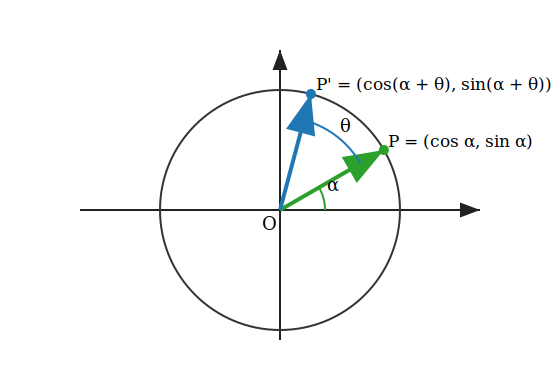

Then

$$
P =
\begin{bmatrix}
\cos\alpha \\
\sin\alpha
\end{bmatrix}
$$

Rotating P by θ should move it to angle

$$
\alpha + \theta
$$

So the rotated point should be

$$
\begin{bmatrix}
\cos(\alpha + \theta) \\
\sin(\alpha + \theta)
\end{bmatrix}
$$

Now multiply:

$$
\begin{bmatrix}
\cos\theta & -\sin\theta \\
\sin\theta & \cos\theta
\end{bmatrix}
\begin{bmatrix}
\cos\alpha \\
\sin\alpha
\end{bmatrix}
$$

This gives

$$
\begin{bmatrix}
\cos\theta\cos\alpha - \sin\theta\sin\alpha \\
\sin\theta\cos\alpha + \cos\theta\sin\alpha
\end{bmatrix}
$$

Reordering the factors,

$$
=
\begin{bmatrix}
\cos\alpha\cos\theta - \sin\alpha\sin\theta \\
\sin\alpha\cos\theta + \cos\alpha\sin\theta
\end{bmatrix}
$$

Using the addition formulas proved above,

$$
=
\begin{bmatrix}
\cos(\alpha + \theta) \\
\sin(\alpha + \theta)
\end{bmatrix}
$$

Therefore,

$$
\boxed{
\begin{bmatrix}
\cos\theta & -\sin\theta \\
\sin\theta & \cos\theta
\end{bmatrix}
\begin{bmatrix}
\cos\alpha \\
\sin\alpha
\end{bmatrix}
=
\begin{bmatrix}
\cos(\alpha + \theta) \\
\sin(\alpha + \theta)
\end{bmatrix}
}
$$

This proves that the matrix rotates every point on the unit circle by angle θ.

Since any nonzero vector is a scaled version of a unit direction, the same matrix rotates every vector in the plane by angle θ.

---

## 13. From Rotation Matrices To RoPE

Now we can connect this directly to RoPE.

RoPE means Rotary Positional Embedding.

The key idea is simple:

Instead of adding a position vector to a token, RoPE rotates pairs of dimensions inside the query and key vectors.

The rotation is exactly the same rotation matrix we just proved:

$$
R_\theta =
\begin{bmatrix}
\cos\theta & -\sin\theta \\
\sin\theta & \cos\theta
\end{bmatrix}
$$

If we have a 2D vector pair

$$
\begin{bmatrix}
x_1 \\
x_2
\end{bmatrix}
$$

then rotating it by angle θ gives

$$
\begin{bmatrix}
\cos\theta & -\sin\theta \\
\sin\theta & \cos\theta
\end{bmatrix}
\begin{bmatrix}
x_1 \\
x_2
\end{bmatrix}
=
\begin{bmatrix}
x_1\cos\theta - x_2\sin\theta \\
x_1\sin\theta + x_2\cos\theta
\end{bmatrix}
$$

RoPE uses this same operation, but the angle depends on the token position.

If the token position is m, then RoPE rotates by an angle like

$$
m\theta
$$

So the pair becomes

$$
\begin{bmatrix}
x_1\cos(m\theta) - x_2\sin(m\theta) \\
x_1\sin(m\theta) + x_2\cos(m\theta)
\end{bmatrix}
$$

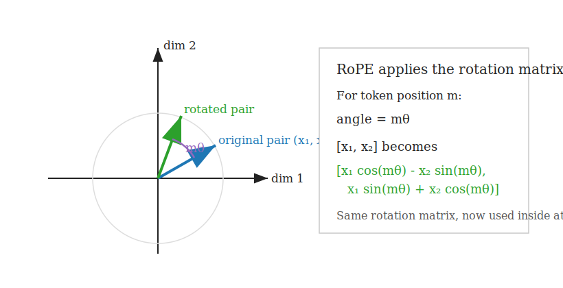

This is the first important bridge:

The rotation matrix rotates points in the plane.

RoPE rotates pairs of hidden dimensions in a transformer vector.

---

## 14. Why RoPE Rotates Query And Key Vectors

In attention, each token produces three vectors:

$$
q = \text{query}
$$

$$
k = \text{key}
$$

$$
v = \text{value}
$$

Attention compares queries and keys using a dot product:

$$
q \cdot k
$$

RoPE applies position-dependent rotations to q and k before this comparison.

For token position m:

$$
q_m \to R_m q_m
$$

For token position n:

$$
k_n \to R_n k_n
$$

Then attention compares

$$
(R_m q_m) \cdot (R_n k_n)
$$

The beautiful part is that the comparison depends on the relative position between the tokens, m - n.

That is why RoPE is useful:

It gives attention access to position through rotation, and especially through relative distance.

---

## 15. Why Multiple Pairs Are Rotated

A transformer vector is not just two numbers.

It might have many dimensions:

$$
[x_1, x_2, x_3, x_4, x_5, x_6, \ldots]
$$

RoPE groups these into pairs:

$$
(x_1, x_2), (x_3, x_4), (x_5, x_6), \ldots
$$

Each pair is rotated like a tiny 2D vector.

Usually, different pairs use different frequencies:

$$
m\theta_1,\quad m\theta_2,\quad m\theta_3,\quad \ldots
$$

So the full vector receives position information at several scales.

In plain English:

RoPE takes the rotation matrix we proved, applies it repeatedly to pairs of dimensions, and chooses the rotation angle from the token position.
